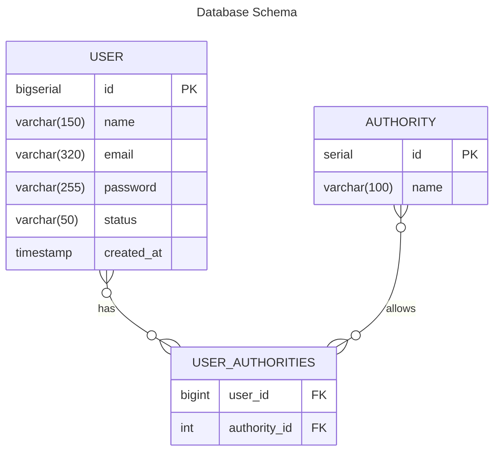

<h1 align="center">Your Review API</h1>


## Resumo do projeto

Sistema para os usuários avaliarem filmes e séries.

## Tecnologias e ferramentas

<a href="https://www.jetbrains.com/idea/" target="_blank"></a>

<a href="https://pt.wikipedia.org/wiki/Java_(linguagem_de_programa%C3%A7%C3%A3o)" target="_blank"></a>

<a href="https://spring.io/projects/spring-boot" target="_blank"></a>
<a href="https://spring.io/projects/spring-data-jpa" target="_blank"></a>

<a href="https://maven.apache.org/" target="_blank"></a>

<a href="https://tomcat.apache.org/" target="_blank"></a>

<a href="https://www.docker.com/" target="_blank"></a>
<a href="https://www.postgresql.org/" target="_blank"></a>
<a href="https://flywaydb.org/" target="_blank"></a>

<a href="https://projectlombok.org/" target="_blank"></a>

<a href="https://junit.org/junit5/" target="_blank"></a>
<a href="https://site.mockito.org/" target="_blank"></a>
<a href="https://www.postman.com/" target="_blank"></a>
<a href="https://en.wikipedia.org/wiki/Unit_testing" target="_blank"></a>

## Funcionalidades

### API de gerenciamento de Usuário

- `Cadastrar Usuário - POST /api/v1/users`: Cadastrar usuário enviando as informações **name**, **email**, 
**password** e **confirmPassword** em um JSON no corpo da requisição.<br>
    - O password é salvo criptografado no banco de dados usando BCryp.

  Segue abaixo um exemplo do corpo da requisição.
    ```json
    {
      "name": "Lorem Ipsum",
      "email": "lorem@email.com",
      "password": "1234567890",
      "confirmPassword": "1234567890"
    }
    ```
  Em caso de sucesso a resposta tem status 201 com um JSON no corpo da resposta contendo **id**, **name**, **email**,
  **status** e **createdAt** do usuário cadastrado.

  Segue abaixo um exemplo do corpo da resposta.
    ```json
    {
      "id": 150,
      "name": "Lorem Ipsum",
      "email": "lorem@email.com",
      "status": "ENABLED",
      "createdAt": "2023-12-10T10:00:00"
    }
    ```

## Diagramas

### Diagrama entidade relacionamento

